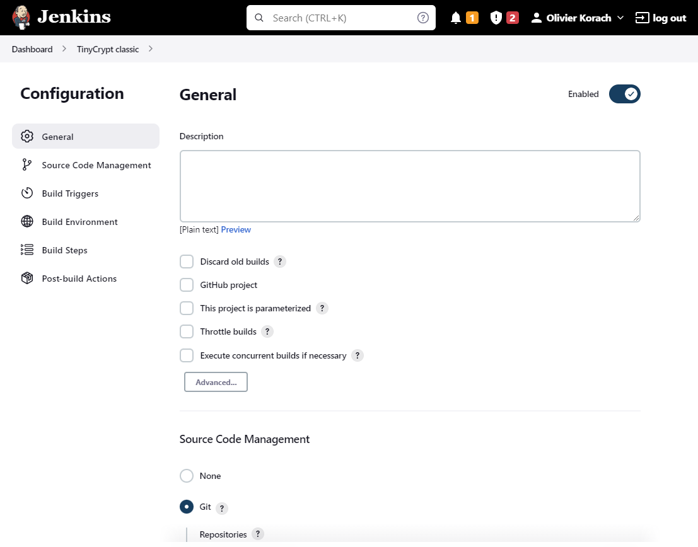
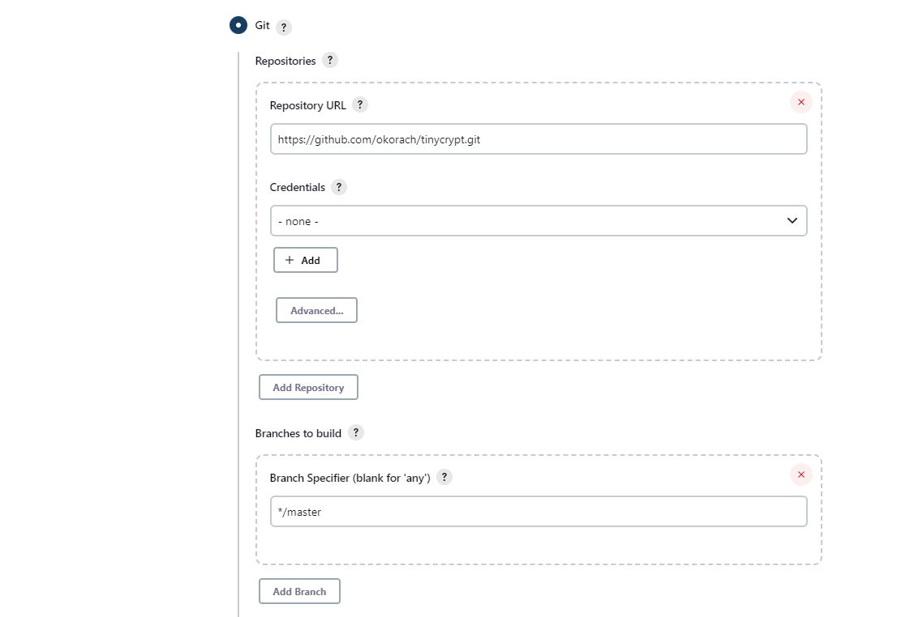
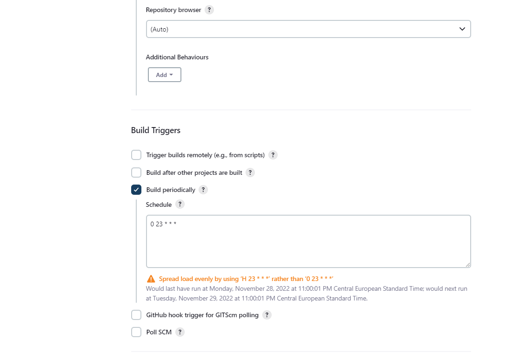
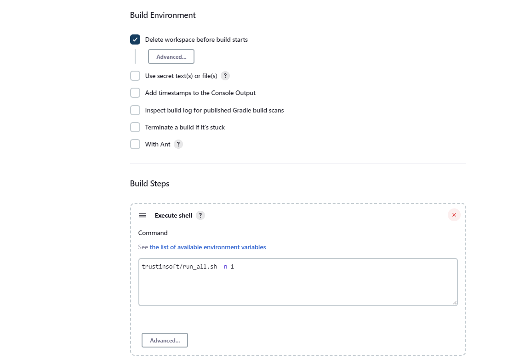
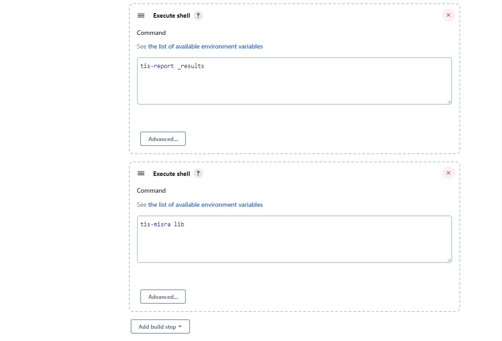
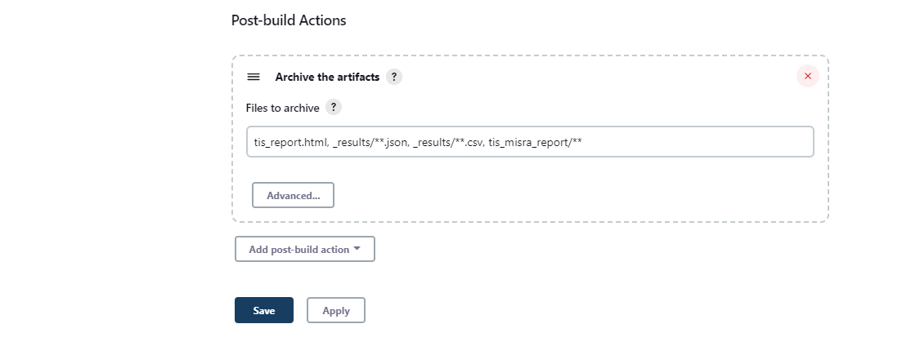

# Demo of **TrustInSoft Analyzer** integration with Jenkins for CI

The purpose of this repository is to demonstrate the possible ways on integrating
TrustInSoft Analyzer in Jenkins CI.
The code used for this demo is the [Intel tinycrypt library](https://github.com/intel/tinycrypt) supplemented with a test driver of 10 tests used for the TrustInSoft analysis

## Setup
You must:
- Setup a Jenkins Server instance (the objective of this demo is not to explain how to install Jenkins,
  but this is rather simple, and there are plenty of documentation and tutorials on the Internet.
  This is not a formal recommendation but you may look at https://www.digitalocean.com/community/tutorials/how-to-install-jenkins-on-ubuntu-20-04
- Setup Jenkins agent that runs a version of Ubuntu supported by the TrustInSoft Analyzer (18.04, 20.04 or 22.04 as of Dec 2022). The Jenkins Server is by default a Jenkins agent too so, at least for small scale deployment, you may not need to do more than installing the Server on Ubuntu
- Install the `tis-analyzer` package on the Jenkins agent and configure access to a valid license (FlexNet or Node locked)

## Jenkins job configuration
There are different ways of defining Jenkins jobs.
- The most modern and flexible way is through pipeline jobs (based on `Jenkinsfile`).
This presents the advantage that the job configuration is code itself, and all configuration changes can be tracked as code changes (like C source code). This is the principle of infrastructure as code. directly stored in the code repository.
We'll first show explain integration using Jenkinsfile based jobs
- Another solution is to use Jenkins classic "freestyle" jobs. This may also be OK, although it has
the drawback that the Job configuration is stored in Jenkins itself, and therefore provides little
traceability of job configuration changes.

Note: In both jobs example, we'll leverage the [run_all.sh](trustinsoft/run_all.sh) script that is quite convenient to run all the 10 analyses defined in this repository.
This is a convenience only and absolutely not mandatory for the jobs.
You may just as well run the `tis-analyzer` commands that you want directly in the job

### Jenkins job based on pipeline

As per the advantage of Infrastructure as code, most of the configuration is defined in the [Jenkinsfile](Jenkinsfile).
The only steps to be taken in Jenkins are:
- Create a Job, of kind **Pipeline** or **Multibranch pipeline**. The main difference is that multi-branch pipeline will allow to conveniently analyze different branches of your code, whereas pipeline is for 1 branch only

### Jenkins jobs based on Freestyle jobs

In this type of jobs the configuration is not textual. It's configured in Jenkins GUI itself.
(Jenkins may then store dans in database and/or XML files, but's that internal)
Configuration is rather self explanatory. See Jenkins screenshots below:

